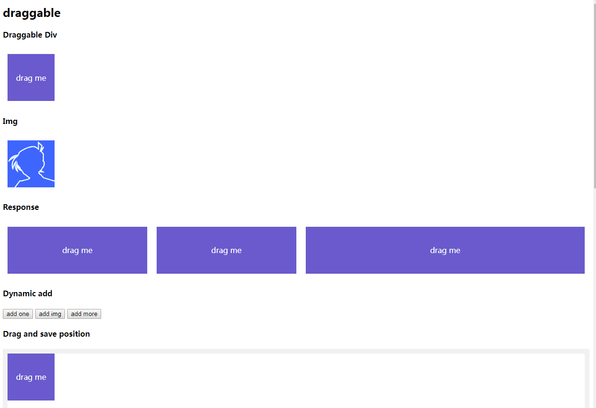
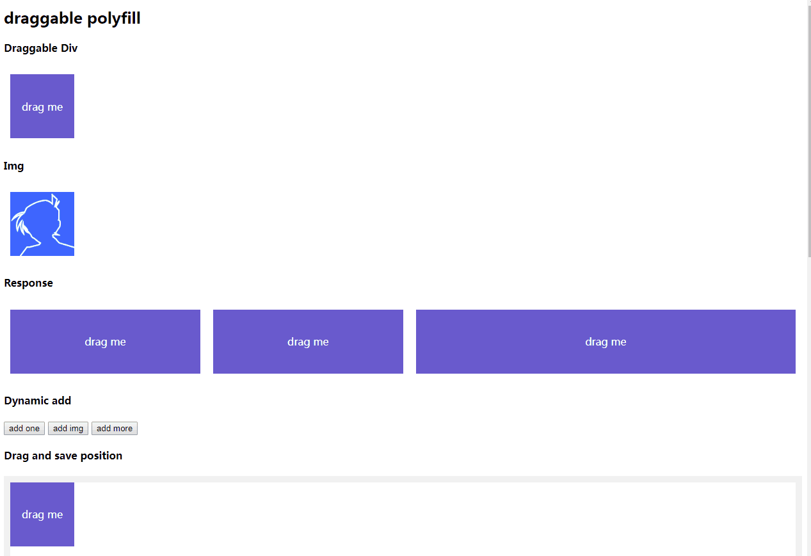

# draggable-polyfill

🌈a beautify polyfill for html5 native drag! 

## Feature

Remove translucent preview!

* light and beautiful
* native and no dependence
* cross framework
* progressive enhancement and no side effects

## Example

* [native drag](http://xboxyan.codelabo.cn/draggable-polyfill/example/index.html)



* [native drag with draggable-polyfill](http://xboxyan.codelabo.cn/draggable-polyfill/example/index_polyfill.html)



## How to use

Import the library code

* [github](https://github.com/XboxYan/draggable-polyfill)

```html
<script src="./lib/draggable-polyfill.js"></script>
```

* [npm](https://www.npmjs.com/package/draggable-polyfill)
```
npm install draggable-polyfill
```

then these native draggable elements( `[draggable=true]`,`img` ) will becoming beautiful

```html
<div draggable="true">drag me</div>

```

you can use [HTML Drag and Drop API](https://developer.mozilla.org/en-US/docs/Web/API/HTML_Drag_and_Drop_API)

```js
//draggable
draggable.addEventListener('dragstart',()=>{})
draggable.addEventListener('drag',()=>{})
draggable.addEventListener('dragend',()=>{})
//allowdrop
allowdrop.addEventListener('dragover',()=>{})
allowdrop.addEventListener('dragenter',()=>{})
allowdrop.addEventListener('dragleave',()=>{})
allowdrop.addEventListener('drop',()=>{})
```

## How to Custom Style

draggable elements will add props `dragging` under dragging, so you can custom style through CSS

```html
<!--your draggable element-->
<div class="dragbox" draggable="true">drag me</div>
```
```css
/**custom styles**/
.dragbox[dragging]{
    box-shadow: 5px 5px 15px rgba(0, 0, 0, .2);
}
```

## Browser Supports

* Chrome
* Firefox

Note:This polyfill works on Chrome and Firefox, not for IE( IE is not supports `setDragImage` ), it will keep default effect.

## License

MIT
